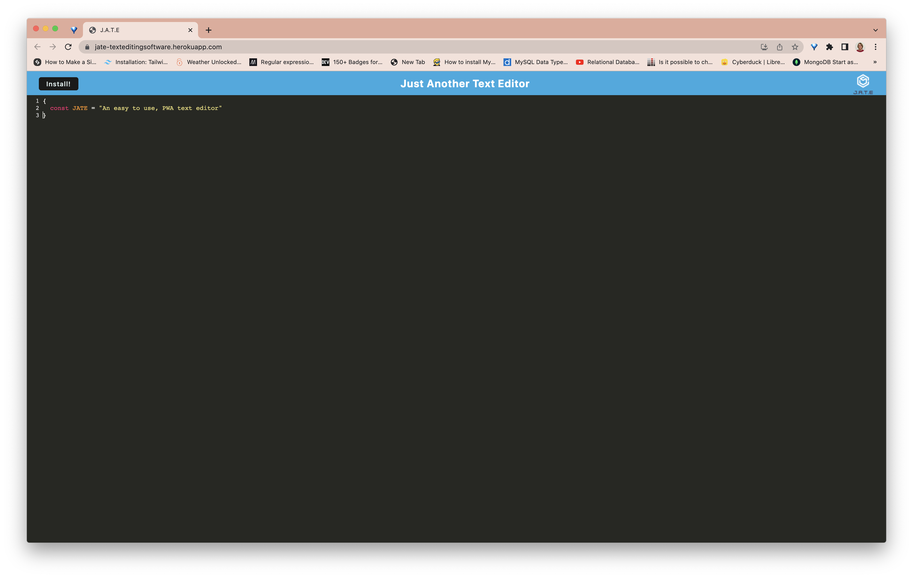
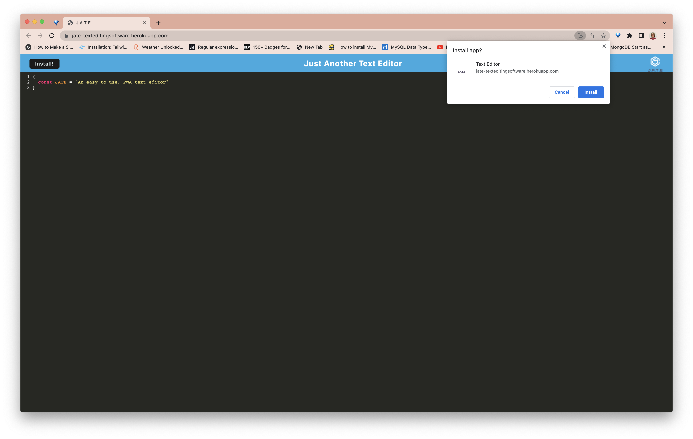
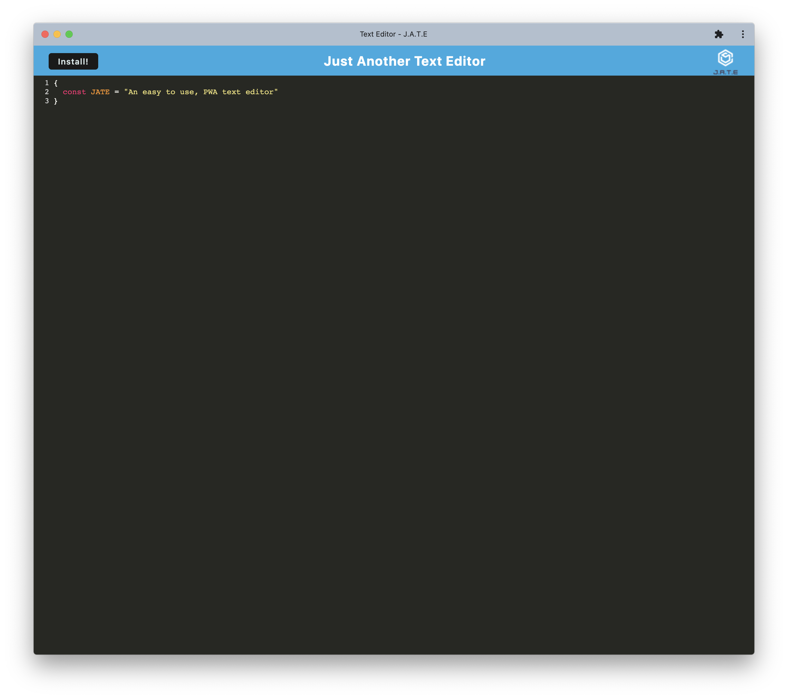
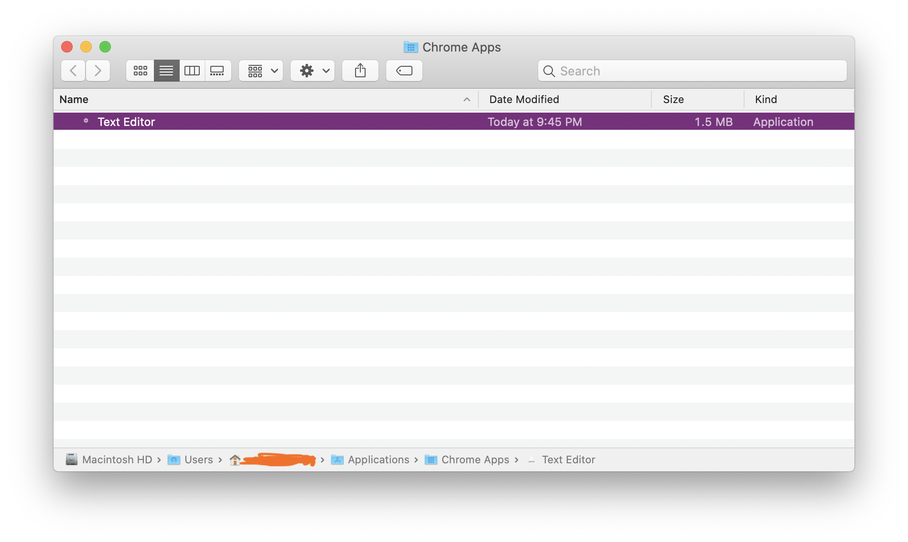

# Text-Editor   
---

## Description

This app is a text editor that functions online or offline as a PWA.

---
## Table of Contents

- [Installation](#installation)
- [Usage](#usage)
- [Contributing](#contributing)
- [Testing](#testing)
- [Questions](#questions)
- [License](#license)

---
## Installation

The user can navigate [here](https://jate-texteditingsoftware.herokuapp.com/). Your browser will give you an icon to install the application to your machine.

---
## Usage

Type your code snippets into the window. Install the application as a Progressive Web App to use it offline.

#### Photos

---
## Contributing

Fork it please

---
## Testing

Download the app and if you find errors, please contact me.

---
## Questions

If you have any questions, please send an email to <andrew.moody96@gmail.com>, or check out my [GitHub](https://github.com/andrewmoody96).

---
### Copyright 2022, Andrew Moody 
  #### License
  
   
  [MIT License](https://opensource.org/licenses/MIT)